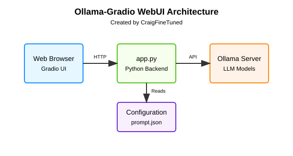

# Ollama Gradio WebUI

A clean, user-friendly chat interface for interacting with Ollama LLM models. This project provides a simple web UI for accessing various Ollama models through three different interfaces.

**Created by: CraigFineTuned**



## Features

- **Chat Interface**: Simple chat with any available Ollama model
- **Agent Interface**: Chat with specialized agents (using system prompts) for specific tasks
- **Vision Assistant**: Upload and discuss images with multimodal models
- **Multi-language Support**: English UI with optional Chinese language support
- **Context Management**: Enable/disable conversation context
- **Simple and Clean UI**: Focused on usability and simplicity

## System Requirements

- Python 3.9.11 or compatible version
- Windows, macOS, or Linux operating system
- Ollama service installed and running locally

## Installation and Setup

### 1. Install Ollama

First, you need to install [Ollama](https://ollama.ai/download) on your system.

### 2. Create a Python Virtual Environment

```bash
# Create a virtual environment
python -m venv .venv

# Activate the virtual environment
# On Windows:
.venv\Scripts\activate
# On macOS/Linux:
# source .venv/bin/activate
```

### 3. Install Dependencies

```bash
# Install the required packages
pip install -r requirements.txt
```

### 4. Run the Application

```bash
# Option 1: Run directly with Python
python app.py

# Option 2: On Windows, use the provided batch file
start.bat
```

The application will be available at `http://127.0.0.1:7860` in your web browser.

## Dependency Versions

This project has been tested with the following package versions:

```
gradio==3.50.2
ollama==0.1.6
pydantic==1.10.8
fastapi==0.95.2
typing-extensions==4.5.0
```

## Usage

### Chat Interface

1. Select an Ollama model from the dropdown
2. Optionally enable context for multi-turn conversations
3. Type your message and click "Submit"
4. Use the "Clear" button to start a new conversation

### Agent Interface

1. Select an Ollama model and an agent type
2. Type your message to interact with the specialized agent
3. The agent responds using a predefined system prompt
4. Available agents include:
   - Translation Assistant
   - Weekly Report Helper
   - Book of Answers

### Vision Assistant

1. Select a multimodal model (e.g., llava:7b-v1.6)
2. Upload an image using the image upload area
3. Type a question about the image
4. Optionally enable "Force Chinese" for Chinese language responses

## Project Structure

```
ollama-gradio-webui/
├── .venv/                  # Python virtual environment
├── app.py                  # Main application code
├── prompt.json             # Agent system prompts
├── README.md               # This documentation
├── requirements.txt        # Python dependencies
└── start.bat               # Windows startup script
```

## Architecture

The application follows a simple client-server architecture:

1. **User Interface**: Gradio web UI running in the browser
2. **Backend**: Python app using Gradio for the web interface
3. **LLM Service**: Local Ollama server for model inference
4. **Configuration**: JSON files for system prompts and settings

## Customization

### Adding New Agent Prompts

To add new agents, edit the `prompt.json` file and add your new prompt:

```json
{
  "New Agent Name": "Your system prompt goes here. This text will be used to provide instructions to the AI model."
}
```

### Using Different Models

Any model available in your local Ollama installation can be used. To add new models:

1. Install the model with Ollama: `ollama pull model-name`
2. Select the model from the dropdown in the UI

## Troubleshooting

- **No models in dropdown**: Ensure Ollama is running with `ollama serve`
- **Chat not responding**: Check if you've selected a model from the dropdown
- **Vision assistant not working**: Make sure you're using a multimodal model like llava
- **System errors**: Check the terminal output for detailed error messages

## Credits

This project was created by **CraigFineTuned**.

It is a modernized and simplified English version of the Ollama Gradio WebUI, making it more accessible to English-speaking users while maintaining compatibility with Chinese language features when needed.
